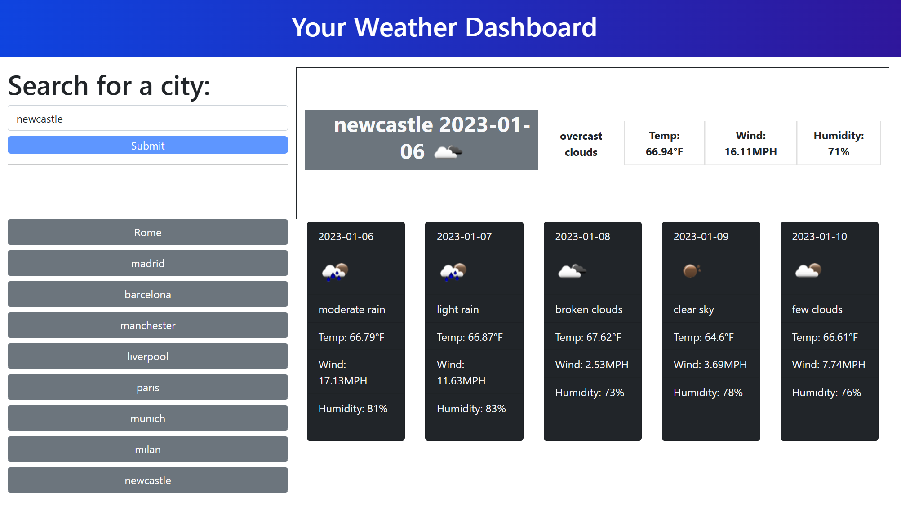

# weather-dashboard
#### by William DiStefano
module 06 Challenge  
<hr>
<br>
<br> 

## Search for a city and get their weather!

Whether you are a commuter on the go, an outdoorsman or just running errands, everyone could use a weather app.  This is a simple page which lets the user search for a city and recieve a 5-day weather prediction for that area.

## User Story

```
AS A person in need of weather related information
I WANT to research a location's weather
So That I can plan ahead in case of inclement weather
```

## What it does

```
This weather application uses the openweathermap api to get weather information for a city. At first the page will only have an input box with a submit button and instructions for use.  Upon search, the instruction box is replaced with the current forecast.  At the same time, weather cards are formed for the next 5 days.  

Each search is saved as a button and displayed under the search box.  If the user wishes to repeat a search they may click the desired button.  After clicking, the page will repopulate with information on the selected city.
```

<br>

### Examples: 

>Page appears with instructions upon loading  

  

>After searching for one city, Rome, the forecast is displayed.  


>Search with multiple recent searches displayed.  This is the last search before testing clicking a recent button  



>This is how the page will appear after a recent search button was clicked  

